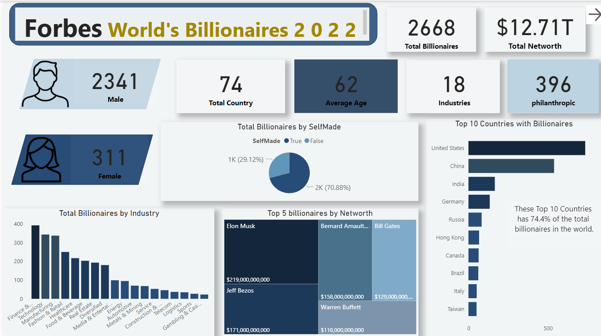
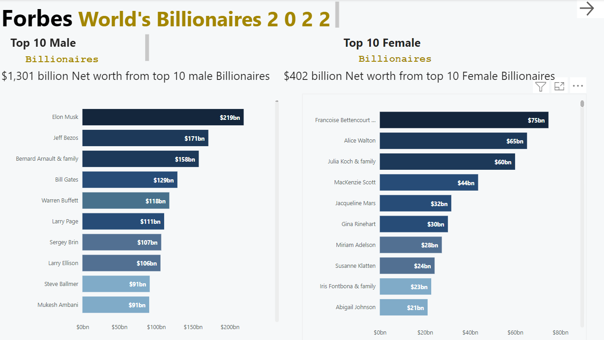
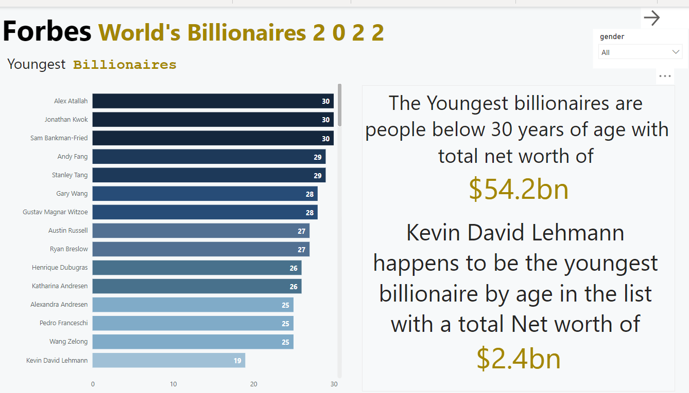
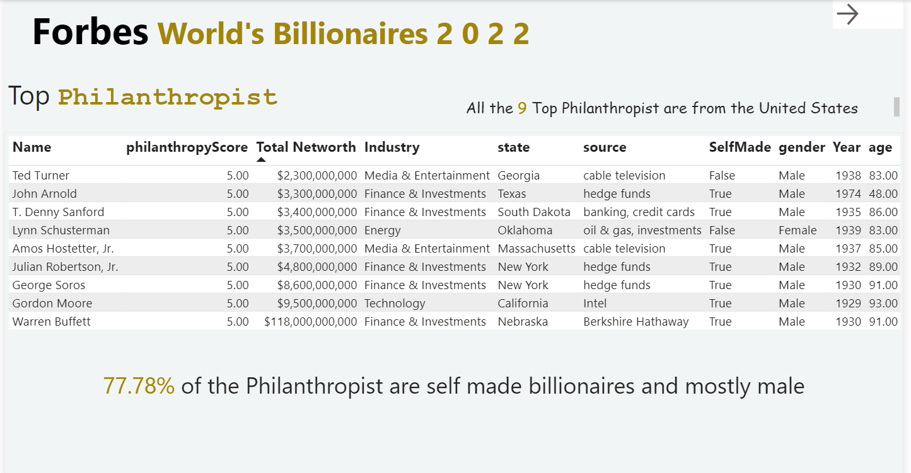
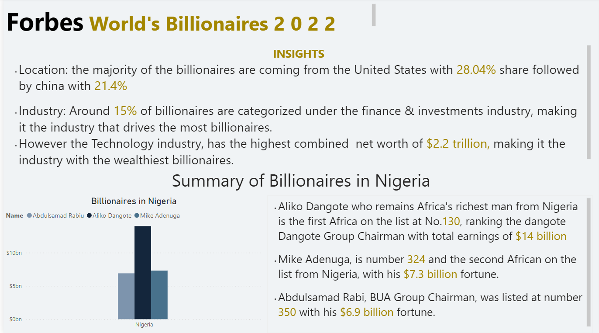

# Analysis on Forbes Billionaire List 2022 Using SQL and Power BI

## Introduction 
The Forbes World's Billionaires list is an annual ranking of the wealthiest people in the world, based on their net worth. This list has been published by Forbes magazine since 1987, and has become a benchmark for wealth and success. It's also a source of inspiration for many people who aspire to great wealth. The list includes detailed information about the individuals' business interests and other relevant information. It's a fascinating resource for anyone interested in the lives of the world's wealthiest people.

## Skills Demonstrated 
- Data Cleaning,
- Data preparation using sql,
- Data Modeling,
- Data Visualization using Power BI
- Filters, Tooltips,
- Storytelling with data,
- Critical Thinking.

## Data Sourcing 
Data was sourced from kaggle

## Problem Statement 
- The top philanthropists who have donated
the most of their wealth to charity.
- The industry or category that has
produced the most billionaires.
- The gender gap among billionaires.
- The top billionaires in each industry.
- The difference between self-made and
non-self-made billionaires.
- The youngest and oldest billionaires.
- The country with the most billionaires.
- Billionaires who made their wealth in
their home country and those who made
their wealth abroad.
- Summary of billionaires in Nigeria

## Data Cleaning 
After loading the data into the MySQL
database, I began the data preparation
process, keeping my desired insights in mind.
Here is a more detailed explanation of what I mean:
- Loading the data into the MySQL
database:** This is the first step in the data preparation process. It involves
transferring the data from the original
source (in this case, Kaggle.com to the
MySQL database.
- Data preparation: This is the process of
cleaning, transforming, and enriching the
data so that it is ready for analysis. This can involve a variety of tasks, such as removing duplicate data, correcting
errors, and adding new information.

## Data Modeling 
After outlining the data in the tables to make it easier to analyze, I loaded it into Power BI for visualization and modeling. I created relationships between the tables where needed using the primary and foreign keys to make it easier to filter the results.

## Data Visualization 
After modeling the data, I created an
interactive dashboard with bookmarks and
page navigation buttons to allow users to
switch between different dashboards and
pages within the report.

First i created a cover Page to show what the report is about.

Then created a general view of the data.

Then created separate visuals for the Top 10 Female and Male Billionaires, youngest
billionaires and Top philanthropist.

Youngest Billionaires 

Top Philanthropist 

Finally, I created an overview page that shows insights seen from the Analysis and the summary of Billionaires in Nigeria.

Here is a link to interact with the Dashboard :

## Thank you For Following Through 

